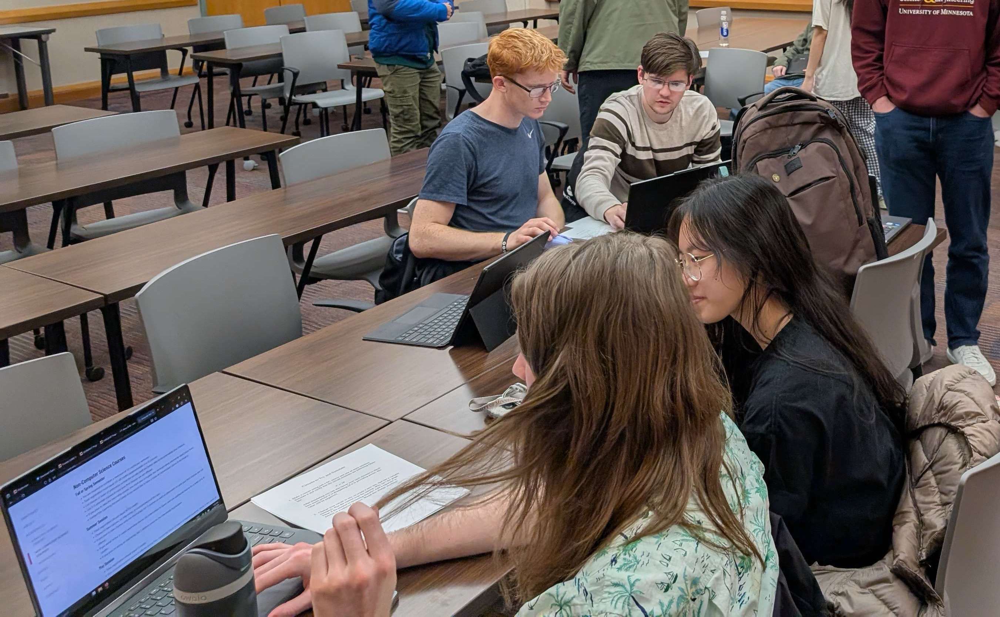

## Outreach (ROE) Committee

Reach Out Ece (ROE) is all about planning workshops to get freshmen and
sophomores experience with topics and software before having to use it in
classes. We also host social events for people to engage with the community
more. Anyone is welcome to come out and help 🙂

