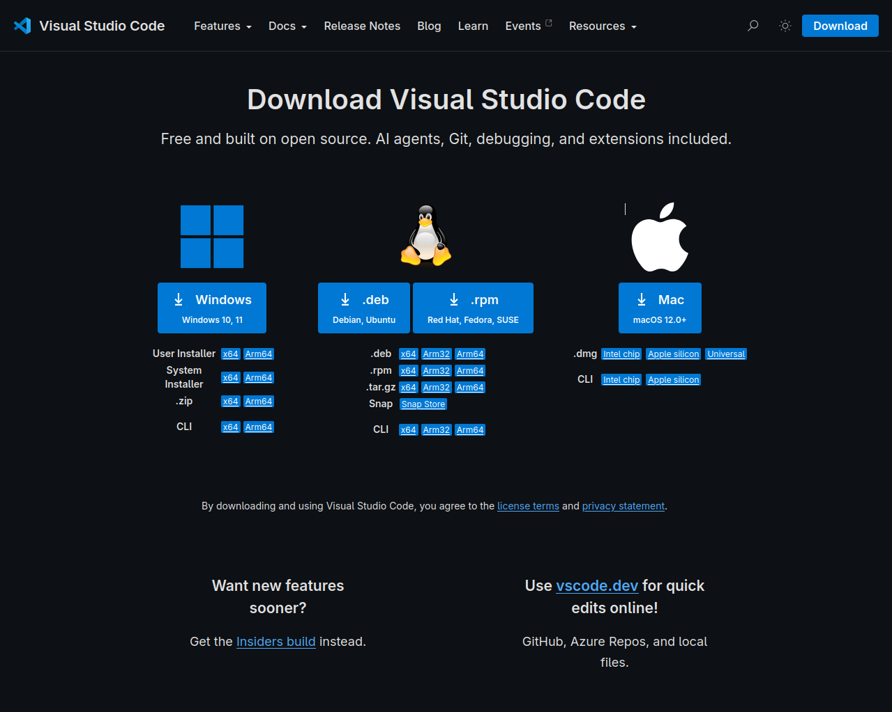
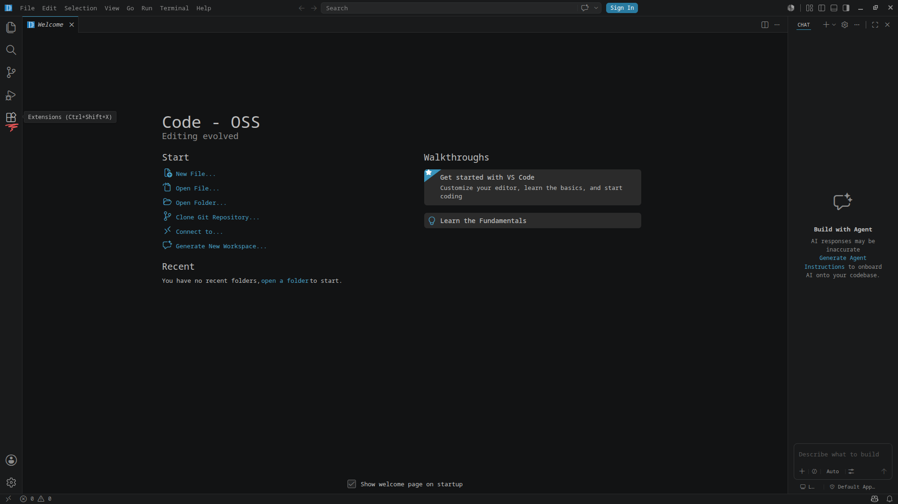
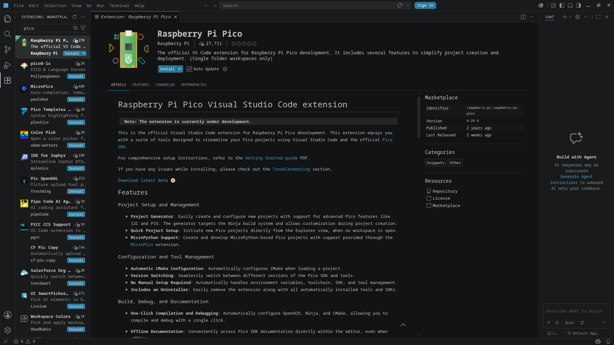
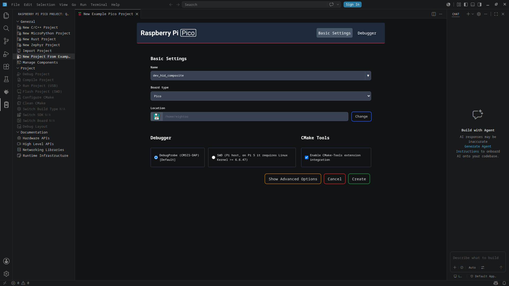
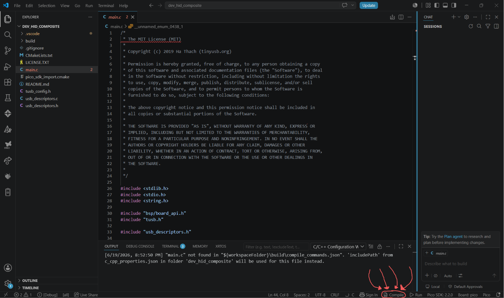
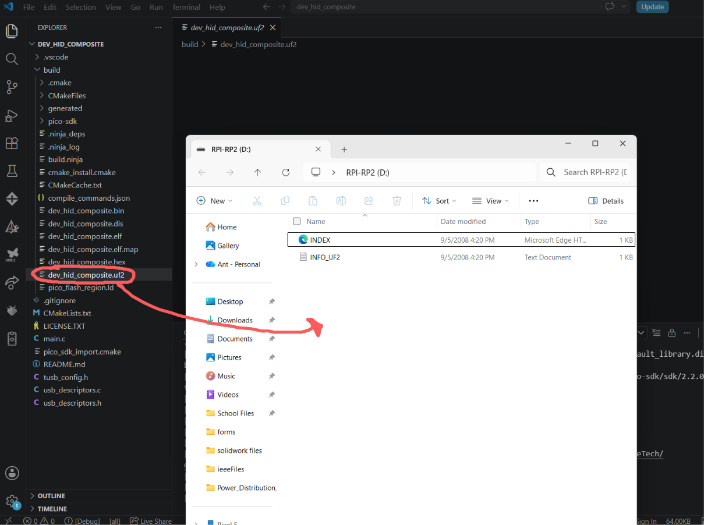

## Table of Contents

* [Installing VS Code](#installing-vs-code)
  * [Windows and Mac](#for-windows-and-macos)
  * [Linux and MacOS with Brew](#for-linux-and-macos-with-brew)
* [Creating The Demo Project](#creating-the-demo-project)
  * [Installing the Pico Extention](#installing-the-pico-extention)
  * [Creating the Example](#creating-the-example) 
* [Flashing to the pico](#flashing-to-the-pico)

---

## Installing VS Code

   #### For Windows and MacOS
  - Use this [link](https://code.visualstudio.com/Download?_exp_download=fb315fc982) to install and follow the instructions given by the installer.
  

   #### For Linux and MacOS with Brew

  - for Brew (MacOS)
  
    - ```bash
      brew install --cask visual-studio-code
      ```

  - For Linux 
    - Usually if you are using linux then you should know how to use your
      package manager.<br> if you do not then you can run
      ```bash 
      cat /etc/os-release
      ```
      and use google to help you. 


  Once again follow the instructions for the installer and wait!

## Creating the Demo Project
  #### Installing the Pico Extention
  Once you open vs Code you should have a window that looks quite similar to
  this. 

  

  On the left should be a stack of 4 boxes with the subtext of extentions. click
  on it and search for the term Pico.

  

  click install, and when done click on the new button on the left toolbar that
  looks like a pico. (rectangle)
  
  #### Creating the Example
  open *"New Project from Example"* and input the same inputs as seen as this
  photo. 

   

  Once done you should have this very dense main.c file appear with all the
  relivent programs and toolchains built and setup for you! doing these manually
  by hand takes a lot of time and mental fortitude. 

  To compile the project you should click on the bottom compile button (circled
  in red below)

   
  
  this will be the button you will press when you want to compile and get a file
  to test on the pico. when compiled you should get a `dev_hid_composite.uf2`
  file. 

  now we can move forward to flashing our code!

## Flashing to the pico

with our code ready to be tested we can officaly move forward and put this
on the pico. thankfully its rather simple. 

before connecting your pico to your PC hold down the button on the device and
keep holding it down while plugging it in. if done successfully a device should
pop up with 2 files in it with the title of `RPI-RP2` you should drag your `dev_hid_composite.uf2` from your build folder into this new device folder. 

 

<br>

If done right it should have auto disconnected and automatically reconnected the
device. and if the button is pressed then these actions should occur at the same
time.

<br>

| HID Input      | Action    |
|--------------- | --------------- |
| Keyboard       | Presses `a`   |
| Mouse          | Moves mouse 5 pixels down and right   |
| Media Controls | Lowers volume    |
| Gamepad        | Presses D-Pad Up and Button A   |

